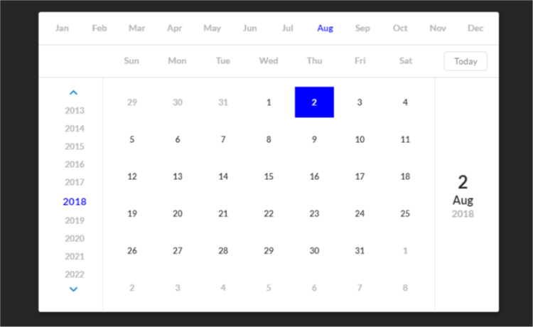

# React UI Calendar

> React UI Calendar

[](https://www.npmjs.com/package/rect-ui-kit) [](https://standardjs.com)

## Description
This component is a unique calendar component based on semantic and react. This doesn't install the semantic and other dependencies. Hence please install 
  "prop-types": "^15.6.2",
  "react": "^16.4.1",
  "react-dom": "^16.4.1",
  "semantic-ui-css": "^2.3.3",
  "semantic-ui-react": "^0.82.1",

## Screenshot


## Install

```bash
npm install --save rect-ui-calendar
```

## Usage

```jsx
import React, { Component } from 'react'
import {RectDatePicker} from 'rect-ui-calendar';

export default class App extends Component {
  constructor(props){
    super(props);
    this.state = {
      selected: '',
    }
  }
  render () {
    const {selected} = this.state;
    return (
      <div>
        <RectDatePicker 
          selected={selected} 
          startYear={2013}
          onSelect={(selected)=>this.setState({selected})}/>
      </div>
    )
  }
}

```

## License

MIT © [tony2k84](https://github.com/tony2k84/rect-ui-calendar)
