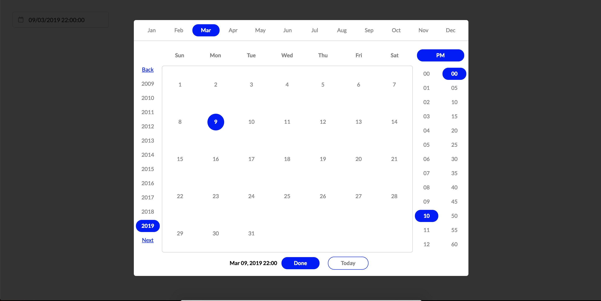

# React UI Calendar

> React UI Calendar

[](https://www.npmjs.com/package/rect-ui-kit) [](https://standardjs.com)

## Description
This component is a unique calendar component based on semantic and react. This doesn't install the semantic and other dependencies. Hence please install 
  "react": "^16.4.1",
  "react-dom": "^16.4.1",

## Screenshot


## Install

```bash
npm install --save rect-ui-calendar
```

## Properties
* open - specifies to open the modal
* selected - pass the date object
* theme - the theme color to be used. defaulted to grey
* onSelect - call back method with date object selected.

## Usage

```jsx
import React, { Component } from 'react'
import { RectDatePicker } from 'rect-ui-calendar';
import { Input, Icon } from 'semantic-ui-react'

export default class App extends Component {
  constructor(props) {
    super(props);
    this.state = {
      selected: null,
      open: false,
      selectedDateString: '',
    }
  }
  onSelect = (selected) => {
    //console.log(selected);
    var str = (parseInt(selected.getDate(), 10)).toString().padStart(2, 0) + "/" +
      (parseInt(selected.getMonth(), 10) + 1).toString().padStart(2, 0) + "/" +
      selected.getFullYear() + " " +
      selected.getHours().toString().padStart(2, 0) + ":" +
      selected.getMinutes().toString().padStart(2, 0) + ":" +
      selected.getSeconds().toString().padStart(2, 0);
    this.setState({ open: false, selectedDateString: str });
  }
  handleDateChange = (e, d) => {
    this.setState({ selectedDateString: d.value })
  }
  open = (e) => {
    const { selectedDateString } = this.state;
    var d = new Date();
    if (selectedDateString) {
      var ds = selectedDateString.split(" ");
      var dt = ds[0].split("/");
      d.setDate(dt[0]);
      d.setMonth(dt[1] - 1);
      d.setFullYear(dt[2]);
      if (ds[1]) {
        var tm = ds[1].split(":");
        if (tm) {
          d.setHours(tm[0], tm[1], tm[2]);
        } else {
          d.setHours(0, 0, 0);
        }
      }
    }

    this.setState({ selected: d }, () => {
      this.setState({ open: true })
    })
  }
  render() {
    const { selectedDateString, selected, open } = this.state;
    return (
      <div style={{ padding: 30, width: 500 }}>
        <Input icon={<Icon name='calendar outline' link onClick={this.open} />}
          style={{ minWidth: 230 }}
          iconPosition='left'
          placeholder='DD/MM/YYYY HH24:MI:SS'
          onChange={this.handleDateChange}
          value={selectedDateString}
        />
        <RectDatePicker
          open={open}
          selectedDate={selected}
          theme='blue'
          onClose={this.onSelect} />
      </div>
    )
  }
}

```

## License

MIT © [tony2k84](https://github.com/tony2k84/rect-ui-calendar)
